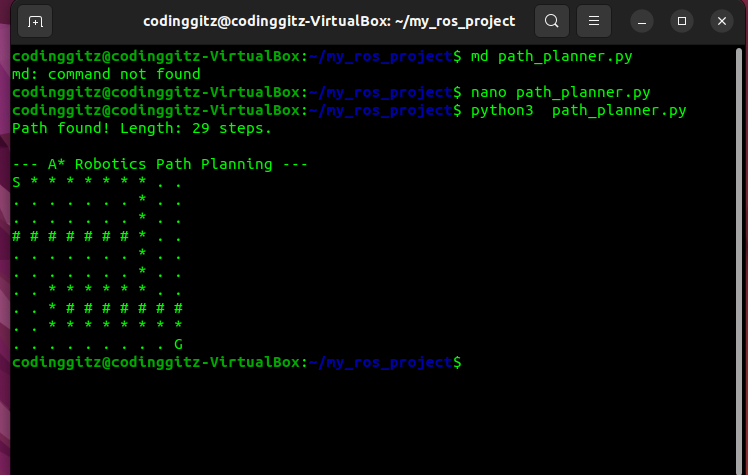

# 🧭 Robotics Path Planning: A* (A-Star) Algorithm

## 📖 Overview
This project is a pure Python implementation of the **A* (A-Star) Pathfinding Algorithm**, widely used in autonomous mobile robotics for obstacle avoidance and navigation.

Unlike standard graph search algorithms (like BFS or DFS), this implementation uses a **heuristic approach (Manhattan Distance)** to efficiently calculate the shortest path between a Start node and a Goal node on a 2D grid map with obstacles.

## ⚡ Key Features
* **Custom A* Implementation:** Built from scratch without external pathfinding libraries to demonstrate algorithmic logic.
* **Heuristic Optimization:** Uses Manhattan distance heuristics to prioritize node exploration, significantly reducing computation time compared to Dijkstra.
* **Obstacle Avoidance:** Navigates around user-defined "walls" (simulated lidar/map data).
* **CLI Visualization:** Renders the grid, obstacles, and calculated path directly in the terminal.

## 🛠️ Tech Stack
* **Language:** Python 3.x
* **Libraries:** Standard Library only (`heapq` for priority queues). No heavy dependencies required.

## 🚀 How to Run
This is a lightweight script that runs in any Python environment.

```bash
# 1. Clone the repository
git clone [https://github.com/YOUR_USERNAME/robotics-algorithms-python.git](https://github.com/YOUR_USERNAME/robotics-algorithms-python.git)

# 2. Run the planner
python3 path_planner.py
